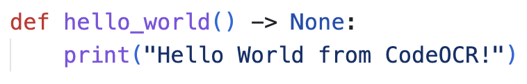
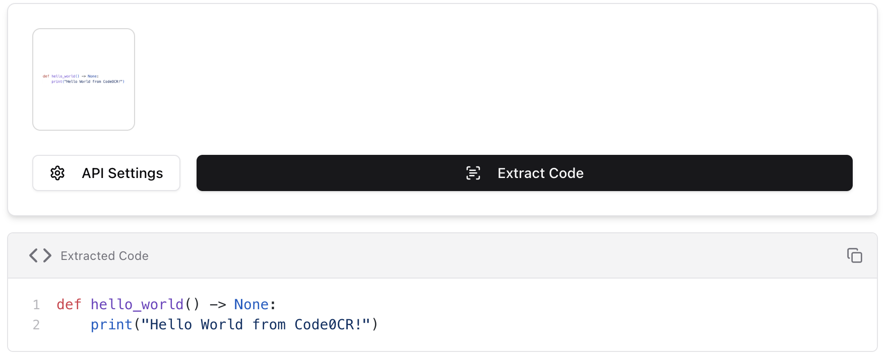

# CodeOCR

Convert code screenshots to copyable text using AI.





## Features

🔧 **Custom OpenAI-compatible API** - Support for various OpenAI-compatible APIs

📡 **Real-time streaming output** - Live code extraction with progress feedback

🌍 **Multi-language interface** - English, Chinese, and Japanese support

## Development & Deployment

### Quick Start

1. **Clone the repository**

   ```bash
   git clone https://github.com/jeremy-feng/codeocr.git
   cd codeocr
   ```

2. **Backend Setup**

   ```bash
   cd backend
   uv sync
   uv run main.py
   ```

3. **Frontend Setup**
   ```bash
   cd frontend
   pnpm install
   pnpm dev
   ```

### Docker Deployment

1. **Configure environment variables**

   ```bash
   cd frontend
   cp .env.example .env
   # Edit .env to set your environment variables
   ```

2. **Deploy with Docker Compose**
   ```bash
   docker compose up codeocr -d
   ```

## License

[MIT License](./LICENSE).
